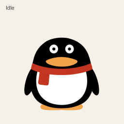

# Pip — Penguin Pet for Codex



Pip is a round penguin with a red scarf, a broad orange beak, and gentle expressions. This repository contains its **approved reference artwork, reproducible v2 sprite atlas, Codex installation package, and previews**. Every animation uses the same reference pixels, with attached flippers that bend smoothly at the shoulders.

## Install in Codex

Use the Codex desktop app with Pets available. Pip uses a **version 2** atlas; the actual pet asset is [`assets/spritesheet.png`](assets/spritesheet.png).

### Option 1: Open the install link

[Install Pip in Codex](codex://pets/install?name=Pip&imageUrl=https%3A%2F%2Fraw.githubusercontent.com%2Fleonxs%2Fpip-pet-for-codex%2Fmain%2Fassets%2Fspritesheet.png&spriteVersionNumber=2)

This opens the desktop pet install flow. The link explicitly selects v2, as documented in the [official pet deep-link reference](https://learn.chatgpt.com/docs/reference/commands#pets).

GitHub may not activate `codex://` links. Copy this entire URL into your browser's address bar and allow it to open Codex:

```text
codex://pets/install?name=Pip&imageUrl=https%3A%2F%2Fraw.githubusercontent.com%2Fleonxs%2Fpip-pet-for-codex%2Fmain%2Fassets%2Fspritesheet.png&spriteVersionNumber=2
```

On Windows, you can also open the same link from PowerShell:

```powershell
Start-Process 'codex://pets/install?name=Pip&imageUrl=https%3A%2F%2Fraw.githubusercontent.com%2Fleonxs%2Fpip-pet-for-codex%2Fmain%2Fassets%2Fspritesheet.png&spriteVersionNumber=2'
```

The raw GitHub PNG must be publicly accessible for this method. If downloading it fails, use the local installer below.

### Option 2: Install the local package

Install Git and **Python 3.10+**, then run:

```sh
git clone https://github.com/leonxs/pip-pet-for-codex.git
cd pip-pet-for-codex
python -m pip install -r requirements.txt
python scripts/install_codex.py
```

The [installer](scripts/install_codex.py) copies `pet.json` and `spritesheet.png` into:

- Windows: `%USERPROFILE%\.codex\pets\pip\`
- macOS/Linux: `~/.codex/pets/pip/`

If `CODEX_HOME` is set, the installer uses `CODEX_HOME/pets/pip/`. Override the home directory with `--codex-home <directory>` when needed.

[`codex/pet.json`](codex/pet.json) is the native Codex manifest, containing `id`, `displayName`, `description`, `spriteVersionNumber: 2`, and `spritesheetPath`. [`assets/pet.json`](assets/pet.json) describes the atlas in detail for this repository's tools.

### Select and show Pip

After either installation method, open **Settings > Pets > Refresh**, then select **Pip**. Enter `/pet` in a chat or choose **Show pet** from the command menu to display it. These controls are described in the [official Pets guide](https://learn.chatgpt.com/docs/pets).

The local installer writes the package; selecting Pip and showing the pet are manual steps.

### Update an existing local Pip

From this checkout, pull the latest files and explicitly update the installed package:

```sh
git pull --ff-only
python scripts/install_codex.py --update
```

The updater verifies the existing package belongs to Pip, preserves the previous manifest and PNG in `pets/pip/.backups/<timestamp>/`, then installs and verifies the new files. An identical installation is left unchanged. The command prints the installation and backup paths. After updating, refresh Pets in Codex and select Pip again; if the old image remains cached, restart the app when convenient.

Without `--update`, conflicting installed files are still preserved and the installer stops. The updater restores the previous package if a replacement fails; after an interrupted process or power loss, the retained backup can be restored manually.

### Troubleshooting

- **Pip is missing:** Check the installer output and the Codex home directory it used. Select **Refresh** again. If Refresh still does not detect Pip, restart the app yourself when convenient.
- **Existing files differ:** The installer preserves conflicting files and stops. Use `python scripts/install_codex.py --update` to back up and replace a verified Pip installation; an identical installation can be run again safely.
- **The atlas is rejected:** Keep `spriteVersionNumber: 2` in the Codex manifest or install URL. This 11-row atlas requires v2; omitting the version defaults to v1.
- **The install link does nothing:** Use the complete URL above, including its HTTPS image URL and version parameter. Check that Codex is installed and Pets are available in your app/workspace.
- **The remote image cannot be fetched:** The repository and raw PNG must be public. Use the local installer for an authorized local checkout instead.
- **The image looks wrong:** Install the original RGBA PNG. GIF previews and contact sheets are display materials, not pet assets.
- **Pip is static:** Check the operating system's reduced-motion setting, which can replace animation with a still frame. See the [official Pets guide](https://learn.chatgpt.com/docs/pets).

## Asset specifications

| Property | Value |
| --- | --- |
| Source | [`assets/spritesheet.png`](assets/spritesheet.png) |
| Format | PNG, RGBA, transparent background |
| Atlas | 1536 × 2288 px |
| Grid | 8 columns × 11 rows |
| Cell | 192 × 208 px |
| Version | v2 |
| Content | 9 states / 57 animation frames + 16 look directions |
| Used / unused cells | 73 / 15; unused cells are fully transparent |

Rows and columns are **zero-based**. Crop a cell at `x = column × 192`, `y = row × 208`, with size `192 × 208`. Keep the full transparent cell canvas to preserve positioning, and play only the valid frames in each state.

## Animation layout

| Row | State | Frames | Motion |
| --- | --- | ---: | --- |
| 0 | `idle` | 6 | Breathing and blinking |
| 1 | `running-right` | 8 | Running toward screen-right |
| 2 | `running-left` | 8 | Running toward screen-left |
| 3 | `waving` | 4 | Holding a flipper up and waving in a continuous loop |
| 4 | `jumping` | 5 | Anticipation, ascent, peak, descent, and landing |
| 5 | `failed` | 8 | Looking down, slumping, and recovering |
| 6 | `waiting` | 6 | Patient glances, blinking, and a gentle foot tap |
| 7 | `running` | 6 | Working in place with focused gaze and flipper taps |
| 8 | `review` | 6 | Inspecting, holding the beak, and tilting the head |
| 9 | Look 0°–157.5° | 8 | First eight gaze directions |
| 10 | Look 180°–337.5° | 8 | Remaining eight gaze directions |

`running` is the working state. Moving runs use `running-right` and `running-left`.

## Look directions


Angles start at **up = 0°**, advance **clockwise**, and step by **22.5°**.

| Row / columns | Angles, left to right |
| --- | --- |
| 9 / 0–7 | 0°, 22.5°, 45°, 67.5°, 90°, 112.5°, 135°, 157.5° |
| 10 / 0–7 | 180°, 202.5°, 225°, 247.5°, 270°, 292.5°, 315°, 337.5° |

The cardinal directions are up 0°, right 90°, down 180°, and left 270°. Direction index `i` maps to row `9 + i // 8` and column `i % 8`.

These poses shift the pupils, head, and beak subtly while keeping the torso, belly, feet, and scarf stable. They express gaze direction rather than full-body rotation. A neutral, forward gaze is separate from 0° and uses idle when no directional target is active.

## Repository layout

```text
pip-pet-for-codex/
├── assets/
│   ├── reference.png          # Approved artwork; unchanged source pixels
│   ├── spritesheet.png        # Final transparent atlas
│   └── pet.json               # Detailed atlas metadata for tools
├── codex/
│   └── pet.json               # Native Codex pet manifest
├── previews/
│   ├── all-states.gif
│   ├── look-loop.gif
│   ├── idle-jump-idle.gif
│   └── motion-stills.png
├── scripts/
│   ├── build_sprites.cjs      # Source extraction and anchored flipper/scarf deformation
│   ├── poses.cjs              # All state and gaze transforms
│   ├── install_codex.py
│   ├── test_install_codex.py
│   ├── validate.py
│   ├── extract_frames.py
│   └── make_previews.py
├── qa/
│   ├── generation-validation.json  # Source hashes, scale, and frame bounds
│   └── validation.json
├── docs/generation.md
├── requirements.txt
├── package.json
├── package-lock.json
└── README.md
```

Local `work/` files are ignored by Git and are unnecessary for using the final asset.

## Validate, extract, and preview

Run from the repository root with Python 3.10+ and Pillow (`>=11,<13`):

```sh
python -m pip install -r requirements.txt
python scripts/validate.py
python scripts/extract_frames.py --output work/frames
python scripts/make_previews.py --output work/previews
```

Validation checks the RGBA mode, dimensions, metadata layout, occupied and transparent cells, cell borders, hidden RGB values in transparent pixels, and the atlas SHA-256. The [validation report](qa/validation.json) records the packaged asset's results.

All extraction and preview tools read the final atlas directly and require no ImageGen calls. See [`idle-jump-idle.gif`](previews/idle-jump-idle.gif) for state transitions and [`motion-stills.png`](previews/motion-stills.png) for representative poses.

## Rebuild the animations

To rebuild from [`assets/reference.png`](assets/reference.png), install Node.js 20.9+ and run:

```sh
npm ci
npm run build
python scripts/validate.py --output qa/validation.json
python scripts/make_previews.py --output previews
python scripts/test_install_codex.py
```

The builder writes the atlas, source and atlas checksums in the metadata, and [`qa/generation-validation.json`](qa/generation-validation.json). It removes only flood-connected exterior white, preserves enclosed white areas, and reuses the source's colors and curves. The neutral idle frame uses the complete source silhouette. Other frames bend textured flippers and the scarf tail from anchored roots, deform the connected feet as one surface, and coordinate body motion, gaze, and blinking. Shoulders stay behind the scarf while raised flipper tips can cross in front. Frame scale stays fixed; the builder rejects any pose that reaches a cell border.

## Creation and limitations

The current artwork is the approved reference PNG. Animation frames are built deterministically from its pixels, without independently generating or redrawing each pose. The previews are cropped from the final encoded PNG. The [generation notes](docs/generation.md) describe the process in Chinese.

The scripts reproduce the atlas, checks, frame exports, and previews. The artwork remains a front-facing 2D character; traveling poses lean and look toward the travel direction. Visual review remains necessary for anatomy, motion, and state transitions. GIF colors, transparency, and timings are for demonstration; use the RGBA PNG for installation or integration.

The desktop selection and display steps require manual confirmation in the app. Repository checks do not establish end-to-end UI acceptance on every Codex version.

## License

No `LICENSE` file or open-source license has been provided. Public repository access does not itself grant redistribution, relicensing, or commercial-use rights; obtain explicit permission from the rights holder for those uses.
